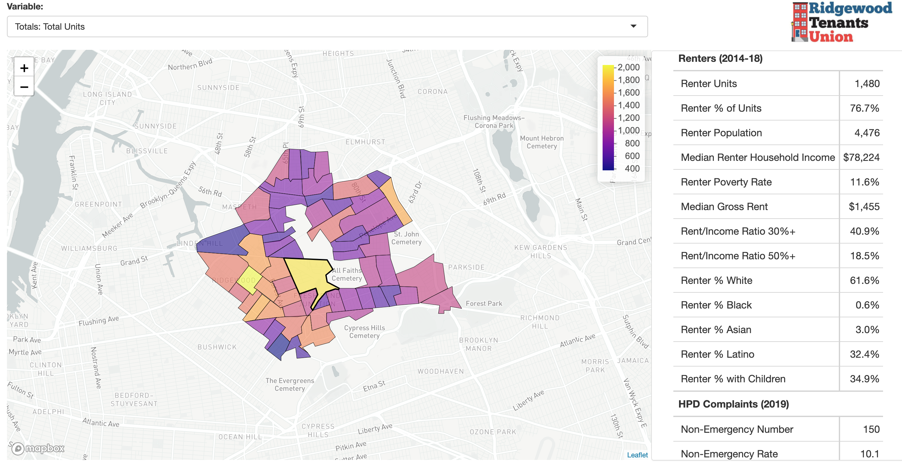

# Ridgewood Tenants Union - Neighborhood Map

Neighborhood map built for the [Ridgewood Tenants Union](http://ridgewoodtenantsunion.org/).

**[See the map!](https://maxwell-austensen.shinyapps.io/rtu-map/)**

## Installation

You'll need to download and install both [R](https://cloud.r-project.org/) and [RStudio](https://rstudio.com/products/rstudio/download/#download).

This project uses [`renv`](https://rstudio.github.io/renv/articles/renv.html) to handle dependency management. To get this project set up on your own system, open the project in RStudio (and open the `.Rproj` file), install `renv` (`install.packages("renv")`), and run `renv::init()`. 

## Environment variables

Edit `.env_sample` to fill in the variables and save it as `.env`. 

You can get your own Census API key [here](http://api.census.gov/data/key_signup.html). 

The credentials for the Housing Data Coalition's instance of [NYCDB](https://github.com/nycdb/nycdb) can be found in a [pinned message in the #tech channel](https://housingdatacoalition.slack.com/files/U4ERA5926/FFMKK7R24/image.png).

## Create data for map

The file [`create-tract-data.R`](create-tract-data.R) prepares all the indicator values and tract geometries for the map and saves the files in [`app/data`](app/data). Census tract geometries and American Community Survey data are accessed using the package [`tidycensus`](https://walker-data.com/tidycensus/). The rest of the indicators are prepared with a long SQL query on a a copy of NYCDB, which is a PostgreSQL database loaded with a variety of NYC housing datasets created using the [`nycdb`](https://github.com/nycdb/nycdb) python library maintained by the Housing Data Coalition.

In addition to the values for all these indicators, there is a manually created csv file ([`indicator-info.csv`](app/data/indicator-info.csv)) with additional information about each indicator used in the app for formatting values and creating human-readable variable names.

## Create and publish app

The interactive map is created using the [`shiny`](https://rstudio.com/products/shiny/) package. For more details on how this app is constructed see the [`README.md`](app/README.md) in the app directory.

To deploy the app locally run `shiny::runApp("app")`. 

The app is published for free on [shinyapps.io](https://www.shinyapps.io/) using `rsconnect::deployApp("app")`. For more details on using shinyapps.io see this helpful [guide](https://shiny.rstudio.com/articles/shinyapps.html).
